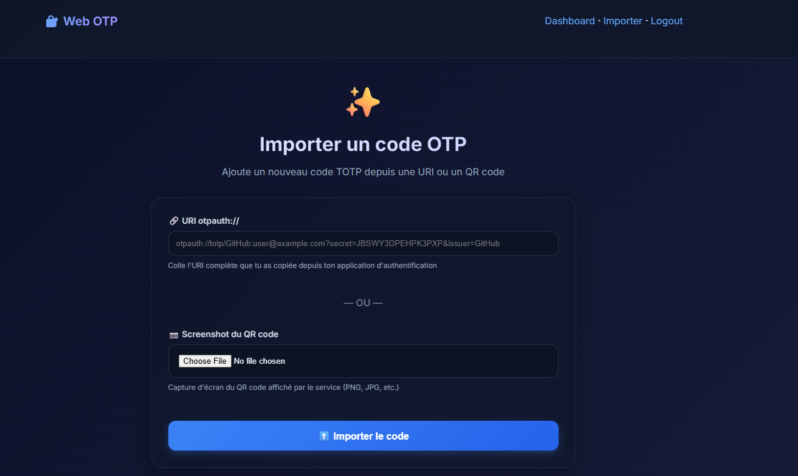
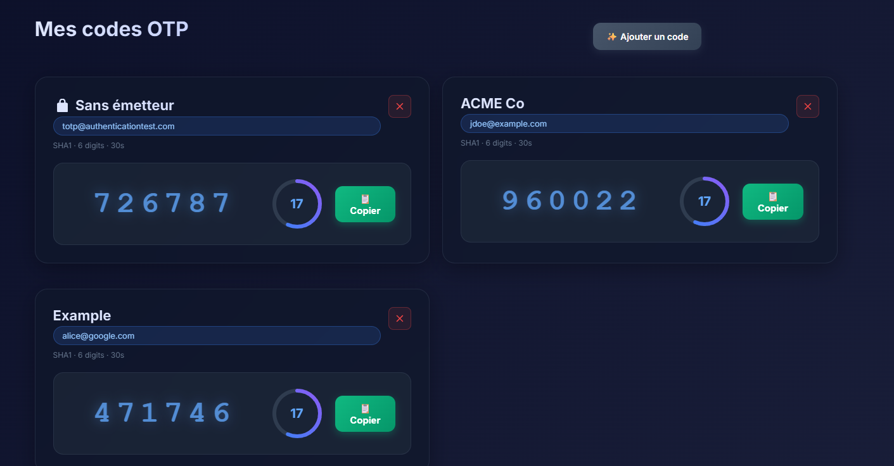

# Web OTP (QR → TOTP)

Web app Flask pour générer des codes TOTP depuis un **QR code** (screenshot) ou une **URI otpauth://**. Secrets chiffrés (Fernet). Login simple via variables d'environnement.

## Captures d'écran





## Prérequis
- Python 3.12+
- libzbar (pour lire les QR)
  - Ubuntu/Debian: `sudo apt-get install -y libzbar0`
  - macOS (brew): `brew install zbar`

## Installation et lancement

### 1. Créer l'environnement virtuel
```bash
python -m venv .venv
source .venv/bin/activate
```

### 2. Installer les dépendances
```bash
pip install -r requirements.txt
```

### 3. Configurer les variables d'environnement
```bash
cp .env.example .env
# Édite .env avec vos valeurs (voir section Configuration ci-dessous)
```

### 4. Générer une clé Fernet
```bash
python -c "from cryptography.fernet import Fernet; print(Fernet.generate_key().decode())"
# Copie la sortie dans .env comme valeur de FERNET_KEY
```

### 5. Charger les variables et lancer l'app

**Option A : Script de démarrage (recommandé)**
```bash
./start.sh
```

**Option B : Manuel**
```bash
export $(grep -v '^#' .env | xargs)
python app.py
```

### 6. Accéder à l'application
Ouvre http://127.0.0.1:8000/login dans ton navigateur.

## Configuration

Édite le fichier `.env` avec tes valeurs sécurisées :

```env
ADMIN_USER=admin
ADMIN_PASSWORD=VotreMdpSecurise123!
FLASK_SECRET_KEY=cle-secrete-flask-au-moins-32-caracteres
FERNET_KEY=votre-cle-fernet-generee
DATABASE_URL=sqlite:///otp.db
HOST=127.0.0.1
PORT=8000
DEBUG=true
```

**⚠️ Mode développement :** `DEBUG=true` active l'auto-reload et les messages détaillés.  
**🔒 Production :** Mets `DEBUG=false` et utilise un serveur WSGI (Gunicorn, uWSGI).

## Fonctionnalités

✅ **Import flexible** : QR code (screenshot) ou URI `otpauth://`  
✅ **Sécurité** : Secrets chiffrés (Fernet), mots de passe hachés (Werkzeug)  
✅ **TOTP temps réel** : Codes actualisés chaque seconde avec compte à rebours  
✅ **Copie rapide** : Bouton pour copier le code dans le presse-papier  
✅ **Multi-algo** : Support SHA1, SHA256, SHA512  
✅ **UI moderne** : Interface sombre et responsive  

## Sécurité

- **Mots de passe forts** : Change `ADMIN_PASSWORD` dans `.env`
- **HTTPS en prod** : Utilise un reverse proxy (Nginx/Traefik) avec certificat SSL
- **Sauvegarde FERNET_KEY** : Conserve-la en lieu sûr (perte = secrets irrécupérables)
- **Limitation d'accès** : IP allowlist, VPN, ou authentification 2FA supplémentaire recommandés

## Limitations

- Attend des URI conformes `otpauth://totp/...`
- Les variantes exotiques peuvent nécessiter des ajustements
- Pour usage personnel/équipe ; pas conçu pour du multi-tenant à grande échelle

